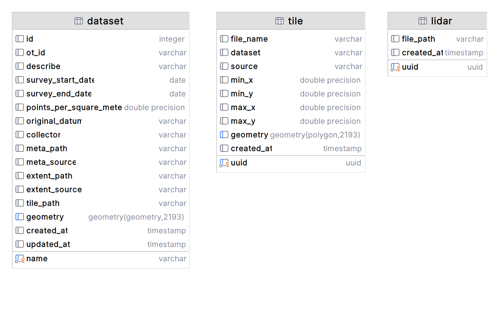

# NewZeaLiDAR

---

## A nationwide LiDAR dataset collection of Aotearoa, New Zealand

<p align="center">
  
  <br>
  <em>LiDAR data visualization for the Taranaki region on New Zealand’s North Island. source: spatialsource.com.au</em>
</p>

NewZeaLiDAR is a comprehensive collection of ground-based LiDAR datasets that cover the entire New Zealand region. The primary objective of this project is to offer users with a standardized and cohesive dataset collection, serving as the primary source for LiDAR data.

NewZeaLiDAR gathers various ground-based LiDAR datasets from different public sources and stores them in file systems. These datasets are then organized in a PostgreSQL database with PostGIS extension. To retrieve the desired data, users can input the boundary of their region of interest in a geojson file. The database will then provide a result dictionary containing dataset names, as well as the paths to corresponding LiDAR and tileindex files that intersect with the input boundary geometry for further use.

The server hosts the database and file system, which will be accessible to the public in the future. The datasets are updated regularly with new LiDAR data.

This package includes an application that generates hydrologically conditioned DEMs from LiDAR data for demonstration purposes. The application is built on [GeoFabrics](https://github.com/rosepearson/GeoFabrics) package.

## Datasets Features

* Geometric coordinate reference systems: [EPSG: 2193](https://spatialreference.org/ref/epsg/2193/)
* Vertical datum: [NZVD2016](https://www.linz.govt.nz/data/geodetic-system/datums-projections-heights/vertical-datum-2016)

## Setup

In your prompt, run the following command to seu up the environment and database:

### 1. Download NewZeaLiDAR from GitHub
```
git clone https://github.com/xandercai/NewZeaLiDAR.git
```

### 2. Set up Python environment
```bash
cd NewZeaLiDAR
conda env create -n newzealidar -f environment.yml
# or even faster
mamba env create -n newzealidar -f environment.yml
# activate the environment
conda activate newzealidar
```

### 3. Set up environment variables

Rename `.env.example` to `.env` and modify the variables as needed.

### 4. Set up database

Before bringing up the database, ensure that you assign the correct environment variables in the '.env' file.

```
docker-compose up -d
```

## Usage

Since the package is in development stage and not installed, we need to add the path of the package (i.e. `__init__.py` directory) to `sys.path` first.

```python
# Suppose current working directory is 'NewZeaLiDAR'. 
import sys
sys.path.insert(0, r'./src/newzealidar')
```

### 1. To create or update region of interest LiDAR datasets

```python
from newzealidar import datasets, lidar
datasets.run()
# with default input, the region of interest is a demo bounding box near Christchurch, 
# if you want to download all available LiDAR datasets, use 'configs/nz_al.geojson' as the input.
lidar.run(roi_file='your_geojson_file')
```

### 2. To retrieve LiDAR datasets of region of interest

```python
from newzealidar import utils
engine = utils.get_database()
result_dict = utils.retreive_dataset(engine, boundary_file='your_boundary_file', instructions='your_instructions_dict')
```

### 3. To retrieve LiDAR datasets with detail of LiDAR files and tile index files path of region of interest

```python
from newzealidar import utils
engine = utils.get_database()
result_dict = utils.retreive_lidar(engine, boundary_file='your_boundary_file', instructions='your_instructions_dict')
```

### 4. To generate hydrologically conditioned DEMs

```python
from newzealidar import process
process.run(catch_id='your_catch_id')
```

## Database Schema

The database schema of LiDAR datasets collection is shown below:



...


